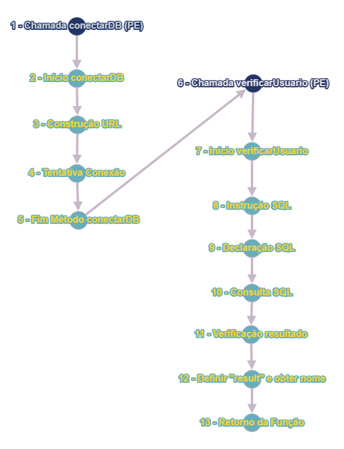

# TESTE CAIXA BRANCA

## Código analisado:
```
import java.sql.Connection;
import java.sql.DriverManager;
import java.sql.ResultSet;
import java.sql.Statement;

public class User {
    public Connection conectarBD() {
        Connection conn = null;
        try{
            **// Ponto de Entrada (1): Chamada do método conectarBD.**
            Class.forName(com.mysql.Driver.Manager).newInstance(); // Nó 1 (2)
            String url = "jdbc:mysql://127.0.0.1/test?user=lopes&password=123"; // Nó 2 (3)
            conn = DriverManager.getConnection(url); // Nó 3 (4)
        }catch (Exception e ) { }
        return conn;
    }
    
    public String nome="";
    public boolean result = false;
    
    public boolean verificarUsuario(String login, String senha){
       String sql = "";
       Connection conn = conectarBD();
       //INSTRUÇÃO SQL
       
       // Nó 4 (5): Início do método verificarUsuario.
       sql += "select nome from usuarios ";
       sql += "where login = " + " ' " + login + " ' ";
       sql += " and senha = " + " ' " + senha +  " ' ; "; // Nó 5 (6)
       
       try{
           Statement st = conn.createStatement(); // Nó 6 (7)
           ResultSet rs = st.executeQuery(sql); // Nó 7 (8)
            if (rs.next()){ // Nó 8 (9)
                result = true; // Nó 9 (10)
                nome = rs.getString("nome"); // Nó 10 (11)
            }
       }catch (Exception e) { }
       return result; // Nó 11 (12)
    }
}

```

## Pontos de observação

### A documentação foi descrita no código?
O código não contém nenhum tipo de documentação, nem mesmo possui comentários suficientes para o seu entendimento, o que seria uma boa prática.

### As variáveis e constantes possuem boa nomenclatura?
O código também não apresenta boas nomenclaturas, já que utiliza de variáveis com nome curtos e nada descritivos.

### Existem legibilidade e organização no código?
Não há formatação adequada, como por exemplo a identação, o que o torna difícil de ler.

### Todos os nullpointers foram tratados?
O código não trata adequadamente possíveis exceções de NullPointerException. Por exemplo, um NullPointerException poderia ser lançado caso 'conn' não seja inicializado corretamente.

### A arquitetura utilizada foi devidamente respeitada?
Não como se aprofundar neste tópico já que temos apenas um trecho do código, não o sistema completo.

### As conexões utilizadas foram fechadas?
Neste código não há chamadas para fechamento em nenhum momento, seja nas conexões, declarações ou resultados. É de extrema importância o fechamento para evitar vazamentos e para manter boas práticas de programação. 

## Grafo de Fluxo



## Complexidade Ciclomática
1. V(G) = 11 - 9 + 2 = 4.
2. V(G) = 3 + 1 = 4.

(Utilizando as duas fórmulas é possível identificar o resultado "4", representando 4 caminhos possíveis.)

## Caminhos e Sequências Possíveis
1. Ponto de Entrada -> Início do método conectarBD -> Construção da URL de conexão -> Tentativa de conexão com o banco de dados -> Fim do método conectarBD;
   
2. Ponto de Entrada -> Início do método verificarUsuario -> Construção da instrução SQL -> Criação da declaração SQL -> Execução da consulta SQL -> Verificação do resultado da consulta (com resultado verdadeiro) -> Definir a variável 'result' como verdadeira e obter o nome -> Retorno da função verificarUsuario;

3. Ponto de Entrada -> Início do método verificarUsuario -> Construção da instrução SQL -> Criação da declaração SQL -> Execução da consulta SQL -> Verificação do resultado da consulta (sem resultado verdadeiro) -> Retorno da função verificarUsuario;

4. Ponto de Entrada -> Início do método verificarUsuario -> Construção da instrução SQL -> Criação da declaração SQL -> Execução da consulta SQL (com erro) -> Tratamento de exceção -> Retorno da função verificarUsuario.

